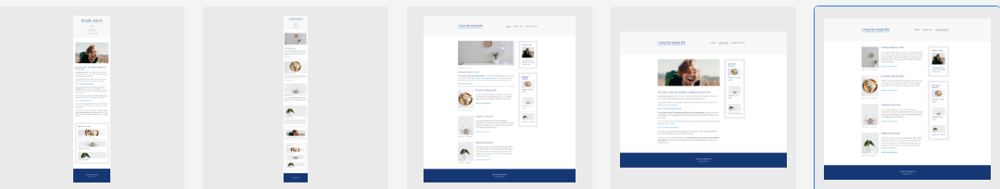

# Living The Simple Life

## Description

The world we live in today can often bring unexpected challenges in that life can get complicated
very quickly. This can bring unhappiness, and in some cases stress, in people's lives.

Living the Simple Life is a blog website that offers people insights into ways to mitigate these
challenges by exploring approaches that can be adopted to find simplicity in the life they're
already living today.

The site is targeted towards those who are experiencing difficulties or unhappiness in their
lives in general, and will be useful to them in that they will become informed about the
subtle they can make in their lives to live a more fulfilled and happier life.

## Features

* Responsive on all device sizes
* Interactive elements

## Technologies Used

### Languages Used

* HTML5
* CSS3

### Frameworks, Libraries & Programs Used

1. Google Fonts
      - Google fonts were used to import the 'Lora' and 'Ubuntu' fonts into the style.css
        file which is used on all pages throughout the project.  

2. Git
      - Git was used for version control by utilizing the Gitpod terminal to commit to Git
        and Push to GitHub.

3. GitHub
      - GitHub is used to store the project's code after being pushed from Git.

4. Flexbox
      - The use of Flexbox made it easier to design a flexible responsive layout structure
        without using float or positioning.

## Features Left to Implement

The link in the 'featured article' section and 'CONTINUE READING' links remain to be 
implemented. Clicking on any of these links takes the user nowhere at this time and,
constitute the left over parts of the project that need to be addressed.

## Validator Testing

* HTML
    - One error/warning was returned when passing through the official [W3C validator](https://
      validator.w3.org/). This was as a result of the use of the role="main" attribute on the semantic element 'main'. The result indicated that the use of this attribute was unnecessary, as such, this error/warning was fixed by excluding the use of this attribute with the 'main' semantic element. No errors/warning were returned when passing through the official [W3C validator](https://validator.w3.org/) after the error/warning was addressed.        
           
* CSS
    - One warning was returned/found when passing through the official [(Jigsaw)validator](https:// 
      jigsaw.w3.org/css-validator/), which indicated that imported style sheets (related to the imported style sheet for Google fonts in this case) are not checked in direct input and file upload modes. This was addressed by excluding the import statement at the beginning of style.css file in the direct input when passing through the official [(Jigsaw)validator](https://jigsaw.w3.org/css-validator/) the second time and no errors/warnings were subsequently found.
       
### Further Testing

- The website was tested on Google Chrome, Microsoft Edge and FireFox browsers.
- The website was viewed on a variety of devices such as Desktops, Laptop, iPhone SE,
  iPhone XR, iPhone 12 Pro, Samsung Galaxy S8+, Samsung Galaxy S20 Ultra, iPad Air, iPad
  Mini, Galaxy Fold and Samsung Galaxy A51/71.
- A large amount of testing was done to ensure that all pages were linking correctly.
- Friends and family members were asked to review the site and documentation to point 
  out any bugs and/or user experience issues.

## Deployment

### GitHub Pages

The project was deployed to GitHub Pages using the folowing steps...

  1. In the Github repository, locate and click the "Settings" button on the menu at the 
     top of the Repository (not top of the page).

  2. Looking at the menu on the left (under the "Code & automation section), scroll down
     until you locate "Pages" then click on it.

  3. Under "Build and deployment", select "Deploy from a branch" from the drop-down menu
     in the "Source" sub-section, and select "main" from the drop-down menu in the "Branch"
     sub-section.

  4. Click on the "Save" button. Once this is done, the page will be automatically refreshed
     with a detailed ribbon display at the top of the page to indicate the successful deployment.

The live link can be found here - 

## Credits

### Content & Media

- All content and media was taken from specimen at [Living The Simple Life Specimen](https://xd.adobe.
  com/spec/75d448ea-569a-4b7e-721b-9bbd3b2b97b9-03e5/grid)

- Instructions on how to implement the use of Flexbox in structuring layout was taken from 
  [MDN-documentation(Flexbox)](https://developer.mozilla.org/en-US/docs/Learn/CSS/CSS_layout/Flexbox)

- Instructions on how to implement form validation on the Newsletter page was taken from 
  [Specific-Scrimba-Tutorial](https://scrimba.com/learn/responsive/the-basics-of-styling-form-cN3Z7EfZ)

- Instructions on how to use "object-fit" to resize an image to fit its container was taken from   
  [MDN-documentation(object-fit)](https://developer.mozilla.org/en-US/docs/Web/CSS/object-fit)

